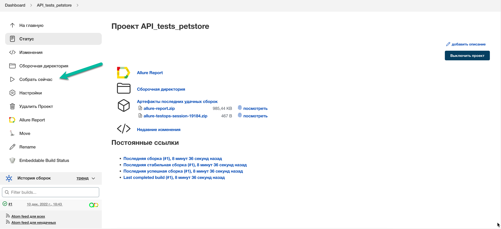
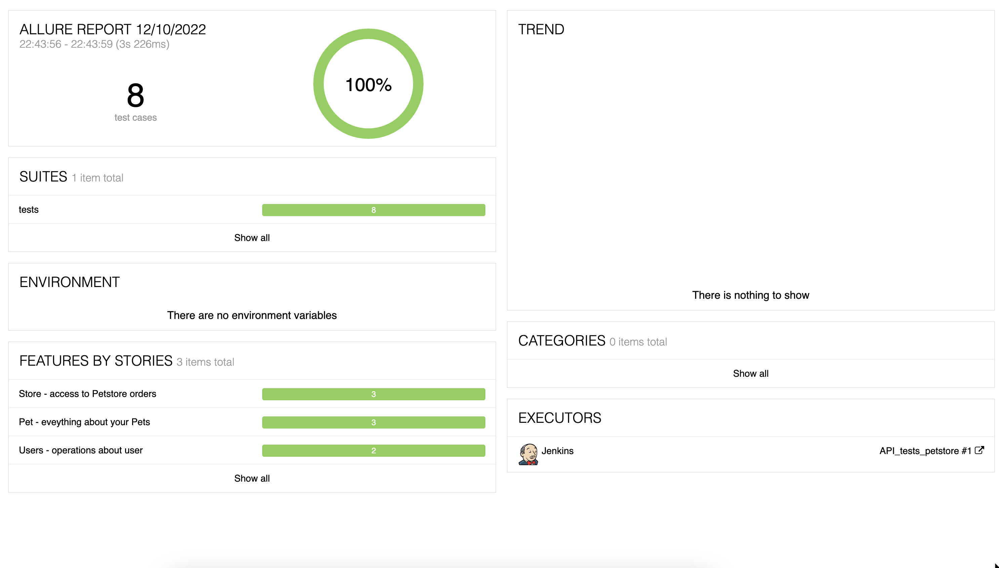
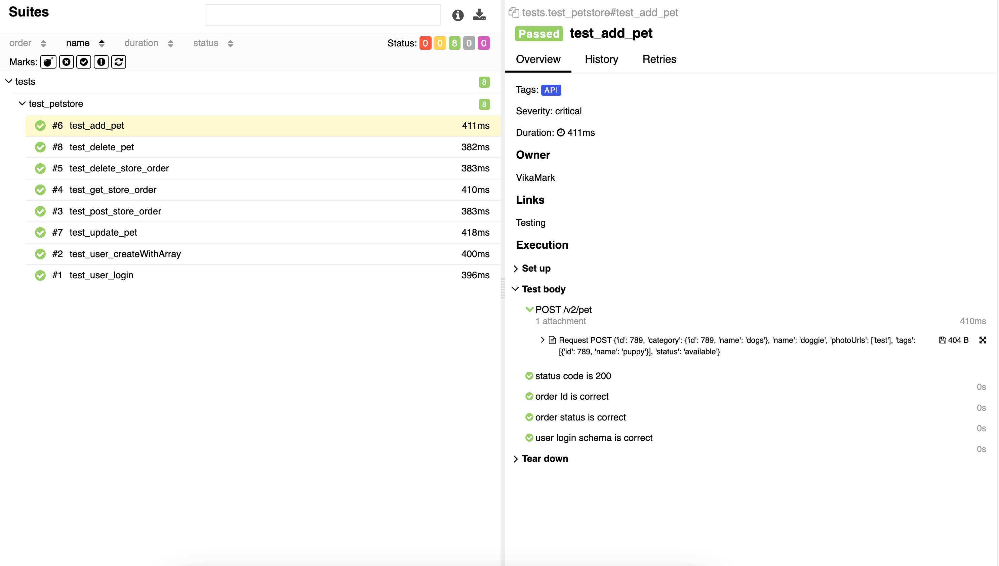
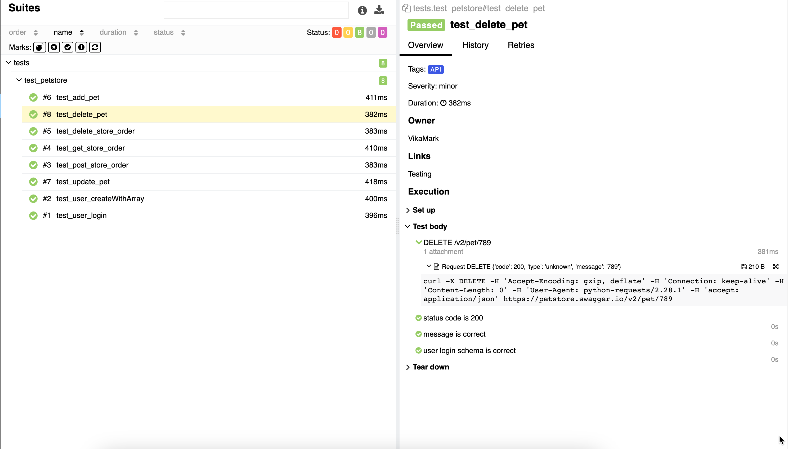
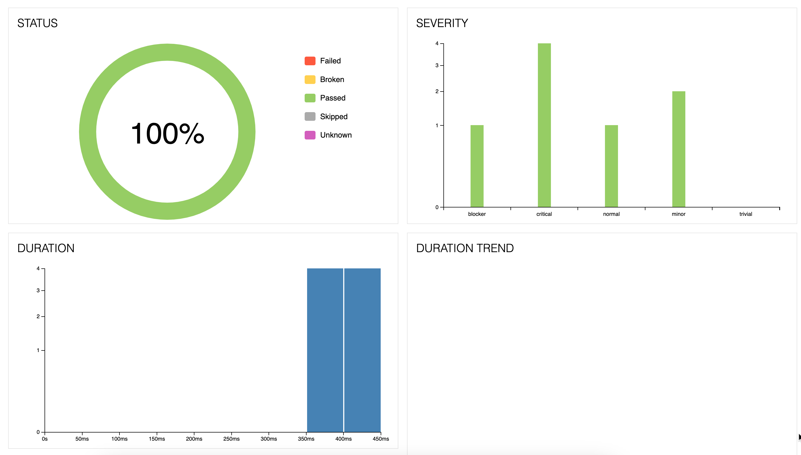
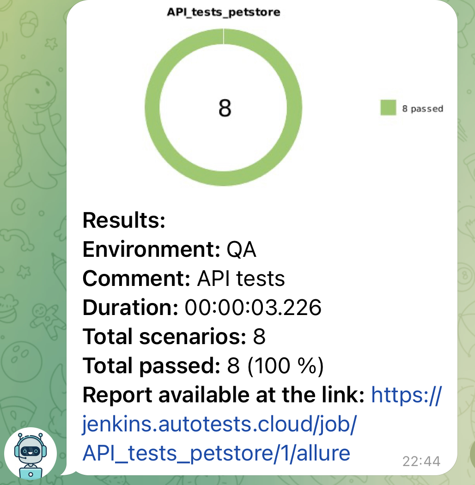
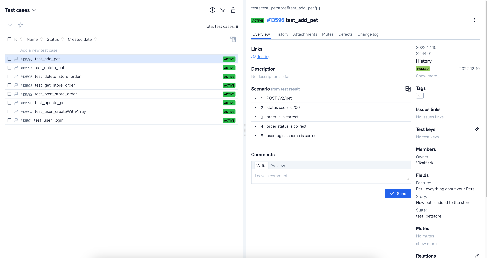
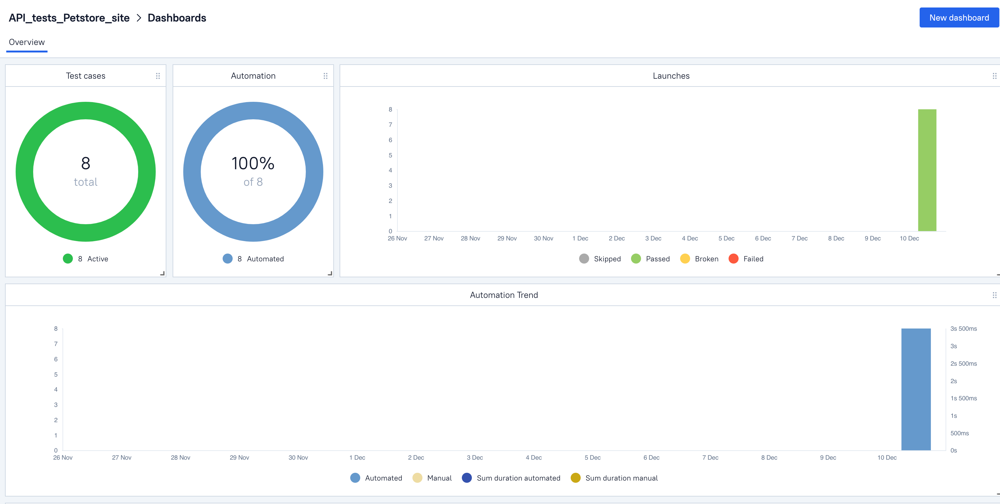
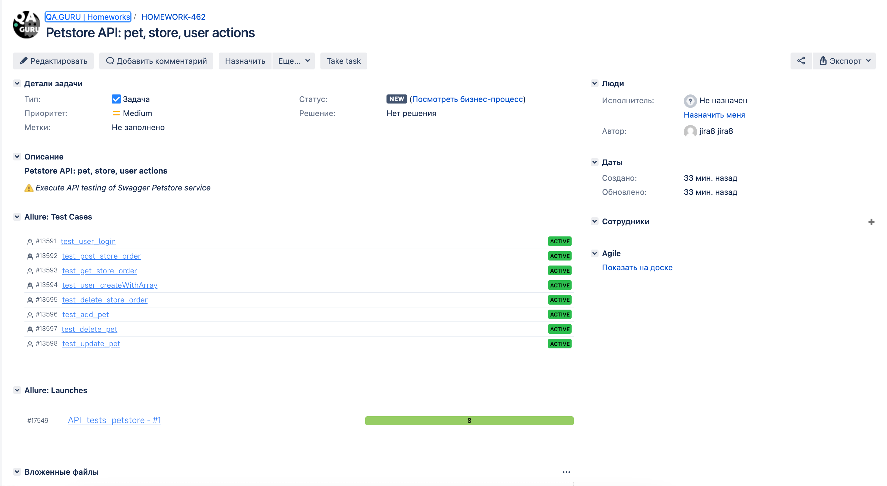

# API Autotests Project on "Swagger Petstore" server testing
> <a target="_blank" href="https://petstore.swagger.io/">Link to the site</a>

## The project is implemented with the use of the following technologies:
Python, Pytest, Requests, PyCharm, Poetry, Jenkins, GitHub, Allure Report, Allure TestOps, Jira

    

#### List of verifications executed in autotests:
- [x] User logging into the system
- [x] Creating list of users with given input array
- [x] Placing an order for a pet
- [x] Search of purchase order by id
- [x] Deleting purchase order by id
- [x] Adding new pet to the store
- [x] Updating existing pet
- [x] Deleting pet from the store

# Autotests were launched on Jenkins server
> <a target="_blank" href="https://jenkins.autotests.cloud/job/API_tests_petstore/">Link to the project in Jenkins</a>

### Tests launch in Jenkins

# Tests execution results report
> <a target="_blank" href="https://jenkins.autotests.cloud/job/API_tests_petstore/1/allure/">Link to Allure report</a>

#### Graphs report tab

# Notification with Jenkins build results report is sent automatically to Telegram-bot

# Allure TestOps project provides API test cases and tests launch data

# API test cases as well as information of autotests launches are integrated in Atlassian Jira

